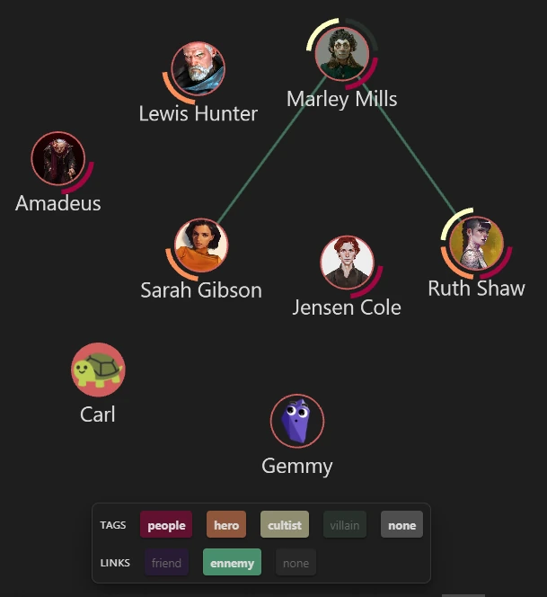
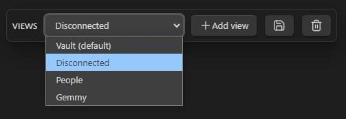
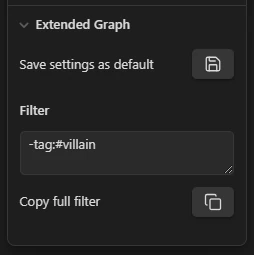
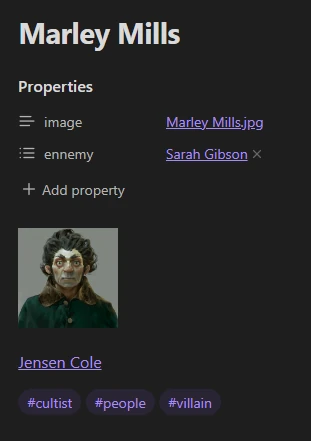
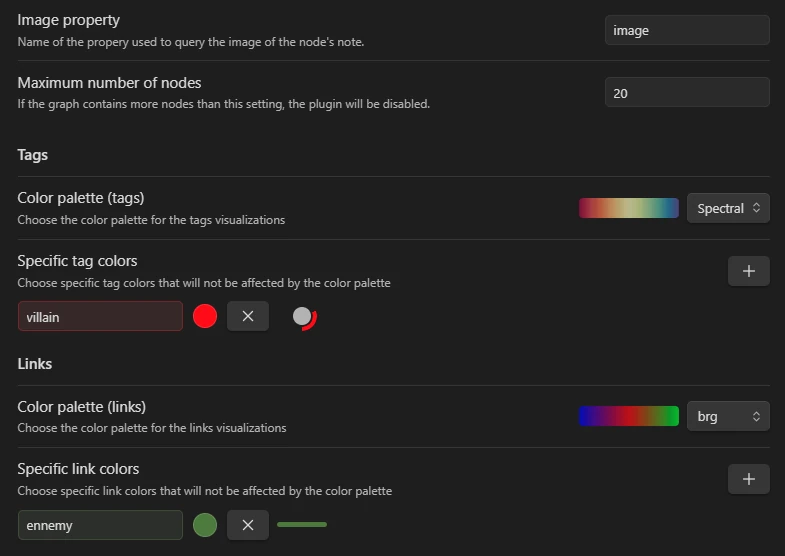

# Extended Graph

> [!IMPORTANT]
> This project is a work in progress. If you want to test this plugin, expect bugs. I appreciate any advice or feedback on possible problems. The same goes for feature requests. Have fun!

# Installation

Available in beta through BRAT:
- Install and enable the [BRAT plugin](https://github.com/TfTHacker/obsidian42-brat) in your vault
- Go to Settings > BRAT > Beta Plugin List > Add Beta Plugin
- Enter `https://github.com/ElsaTam/obsidian-extended-graph` into the input field and select `Add Plugin`

# Usage

## 1 - Toggle plugin

By default, the plugin is deactivated on all newly opened graphs. This avoids unpleasant performance surprises when a graph is opened. Click on the ✨ button at the bottom left to activate the plugin in the current window.

## 2 - Interactive legend

The legend is built automatically using the tags and link types that exist in the graph. Clicking on an element in the legend deactivates the corresponding tags or links in the graph.

## 3 - Manage views

The plugin allows you to save the settings of the current view so that you can quickly switch from one view to another. The default view contains all the nodes and links in the graph and cannot be modified or deleted. Apart from that, you can add as many as you like.

## 4 - Extended graph options

For the moment, the only option available in the graph is to save the current settings as the default view settings. This is the only thing you can change in the default view.

## 5 - Link and Tag types

Tags are obtained directly from the tags contained in a note.

Link types correspond to the property key in which the link is found. If the link is in the body of the note, its type is *none*.

## 6 - Settings

The colour palettes are those used in matplotlib, thanks to Timothy Gebhard's [js-colormaps](https://github.com/timothygebhard/js-colormaps) project (released under MIT licence).

# License

GNU General Public License version 3 (GPLv3) License