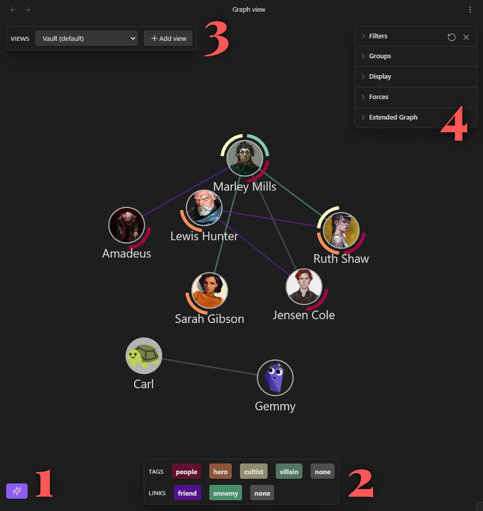

<h1 align="center">Extended Graph</h1>

Enhance the core graph plugin of <a href="https://obsidian.md/">Obsidian</a> with new features.

This plugin enables you to:
- Add images to graph nodes.
- Easily filter by tags and properties.
- Remove links based on relationship types.
- Configure multiple views and switch between them seamlessly.

# Installation

The plugin is available in beta through BRAT:
1. Install and enable the [BRAT plugin](https://github.com/TfTHacker/obsidian42-brat) in your vault.
2. Navigate to `Settings > BRAT > Beta Plugin List > Add Beta Plugin`.
3. Enter `https://github.com/ElsaTam/obsidian-extended-graph` into the input field and select `Add Plugin`.

Have a look at the [wiki](https://github.com/ElsaTam/obsidian-extended-graph/wiki) for more info.

# Disclosures

- **Network use**: only if you allow the loading of external images from the web (disabled by default).
- **Files outside of the vault**: only if you allow the loading of external images from your computer (disabled by default).

# Issues

Since the core graph plugin lacks an API and documentation, many features are experimental, and feedback is critical to identify and resolve bugs.

**Expected risks**:
- **Graph settings loss**: If the app does not close properly, graph settings could be lost. It *should* not happened, I haven't seen this bug in a long time, but I'm waiting for more testing before removing it from this list. If you want to be extra careful, make a copy of the file `.obsidian/graph.json` before enabling the plugin.

**Expected bugs**:
- **Search filter conflicts**: The way the core plugin handles the Search filter makes it hard to synchronize the graph properly. Depending on what was displayed when enabling the plugin and what the search filter changes, it might create some bugs. If this happens, best for now is to set up the search filter while the plugin is disabled and enable the plugin after.
- **Files modification issues**: The plugin might not synchronize correctly with changes made in your vault even if the core plugin handles them properly (such as renaming, deleting or moving a file).
- **Asynchronous errors**: Rapid interactions (e.g., toggling features, switching views, modifying filters) can result in data inconsistencies due to asynchronous processing. Resetting the plugin usually resolves the issue. If not, close and reopen the tab.

Please, if you encounter any bug, even if it is in the list above, report [an issue](https://github.com/ElsaTam/obsidian-extended-graph/issues).

# Supporting

The plugin is completely free to test and will always stay that way, and open source. If you'd like to support its development, you can make a donation via this link: https://github.com/sponsors/ElsaTam

# Credits

- [obsidian-typings](https://github.com/Fevol/obsidian-typings) (MIT License)
- [graph-analysis](https://github.com/SkepticMystic/graph-analysis) (GNU General Public License v3.0)
- [breadcrumbs](https://github.com/SkepticMystic/breadcrumbs) (MIT License)
- [js-colormaps](https://github.com/timothygebhard/js-colormaps) (MIT License)
- [dTree-Seed](https://github.com/JMHeartley/dTree-Seed) (MIT License)

# Features ideas

- Pin nodes [by ribbit12](https://forum.obsidian.md/t/save-node-positions-in-graph-view-edit-and-preview-toggle/1423/89)
- Node shapes [by danitrusca](https://forum.obsidian.md/t/option-to-change-the-shape-of-graph-nodes/13692)
- Tag node colors [by dardan](https://forum.obsidian.md/t/provide-tags-as-graph-css-classes-attributes-to-allow-coloring-of-graph-nodes/6300/17)
- Folders (kind of) [by feva](https://forum.obsidian.md/t/show-folders-as-areas-in-the-graph/8208)
- Nodes stats functions [by akaalias and ryanjamurphy](https://forum.obsidian.md/t/graph-view-allow-to-configure-how-node-size-is-calculated/4247)
- Links stats functions [by SkepticMystic and Emile](https://github.com/SkepticMystic/graph-analysis)
- SVG Export [by Anthea](https://forum.obsidian.md/t/export-of-graph-view-to-svg/25406)
- Interface font [by luisitoalvarz](https://forum.obsidian.md/t/graph-view-should-follow-global-interface-font/47913)
- Zoom on a node [by Docintar](https://forum.obsidian.md/t/find-a-note-in-the-graph/94336)

# License

GNU General Public License version 3 (GPLv3) License
